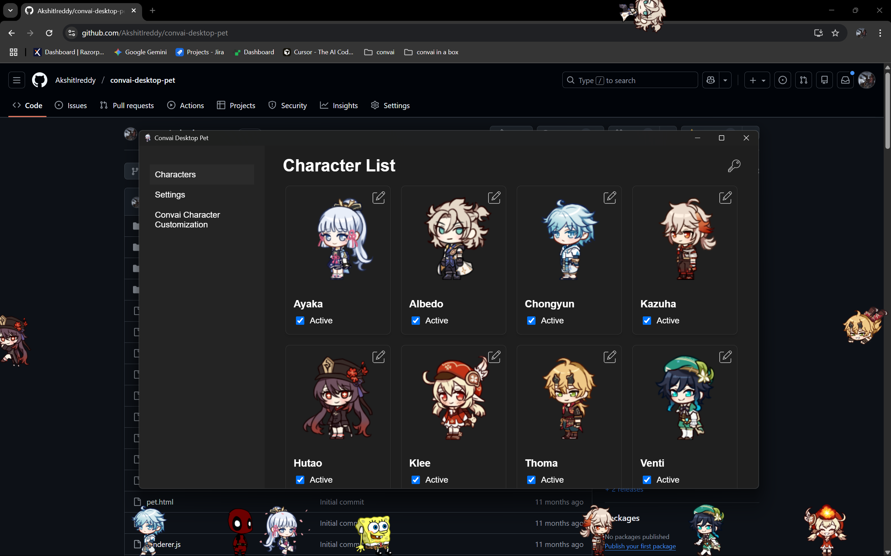

# 🎮 Convai Desktop Pet

> **Bring adorable AI-powered companions to your desktop!**

Transform your desktop into a lively space with cute animated characters that walk, climb, and chat with you using the power of [Convai](https://convai.com).



---

## ✨ What is Convai Desktop Pet?

Convai Desktop Pet is a fun desktop companion app that brings **animated chibi-style characters** to life on your screen. These little friends don't just sit there — they **walk around**, **climb your windows**, **fall with gravity**, and best of all, you can **have real conversations** with them using AI!

Whether you want a cute Genshin Impact character hanging out on your taskbar or a mischievous Cartman roaming your desktop, this app has you covered.

---

## 🚀 Features

| Feature | Description |
|---------|-------------|
| 🎭 **Multiple Characters** | Choose from a variety of adorable characters including Ayaka, Albedo, Chongyun, Kazuha, Hutao, Klee, Thoma, Venti, Deadpool, Spongebob, Cartman, and more! |
| 🤖 **AI Conversations** | Chat with your pet using Convai's powerful AI — they'll respond with voice and text! |
| 🚶 **Living Animations** | Watch them walk, climb edges, fall, get dragged, and perform special idle animations |
| 🖱️ **Interactive** | Drag your pets around the screen and watch them react |
| ⚙️ **Customizable** | Link your own Convai characters with custom personalities |
| 🖥️ **Cross-Platform** | Works on Windows, macOS, and Linux |

---

## 📥 Installation

Download the pre-built installer for your operating system:

| Platform | Download |
|----------|----------|
| 🪟 **Windows** | [Download for Windows](https://github.com/AkshitIreddy/convai-desktop-pet/releases/tag/release-v1.0.0-windows) |
| 🍎 **macOS** | [Download for macOS](https://github.com/AkshitIreddy/convai-desktop-pet/releases/tag/release-v1.0.0-macos) |
| 🐧 **Linux** | [Download for Linux](https://github.com/AkshitIreddy/convai-desktop-pet/releases/tag/release-v1.0.0-linux) |

👉 [View All Releases](https://github.com/AkshitIreddy/convai-desktop-pet/releases)

### Quick Install Steps:
1. Download the installer for your OS from the links above
2. Run the installer
3. Launch **Convai Desktop Pet**
4. Set your API key by clicking on the key icon in the top right corner of the app
5. Select your characters and watch them come to life! 🎉

---

## 🎮 How to Use

### Spawning Characters
1. Open the app and go to the **Characters** tab
2. Check the **Active** box next to any character you want to spawn
3. Watch them appear on your desktop and start exploring!

### Talking to Your Pet 💬
Want to have a conversation with your desktop companion?

1. Hold down the **`Alt`** key
2. **Click** on your pet character
3. A text box will appear — type your message!
4. Hit the submit button and listen to them respond with AI-powered voice and text

### Dragging Your Pet
- Simply **click and drag** your pet to move them anywhere on screen
- Let go and watch them fall with realistic physics!

### Customizing Your Character's Voice & Personality 🎭
Want to give your pet a unique personality and voice? You can customize each character!

1. Go to **Settings** in the app
2. Enter your **Convai API Key** (get one free at [convai.com](https://convai.com))
3. Go to **Convai Character Customization**
4. Click the edit icon on any character to set a custom **Character ID**
5. Now your pet has a unique AI personality and voice!

**Note:** You can create custom characters on the [Convai platform](https://convai.com) with different:
- 🗣️ Voice styles and accents
- 🧠 Personalities and backstories
- 💬 Conversation styles and knowledge

---

## 🎨 Available Characters

| Genshin Impact | Others |
|----------------|--------|
| Ayaka | Deadpool |
| Albedo | Spongebob |
| Chongyun | Cartman |
| Kazuha | |
| Hutao | |
| Klee | |
| Thoma | |
| Venti | |

Each character has unique animations including:
- 🚶 Walking
- 🧗 Climbing
- 🪂 Falling
- 🖐️ Being dragged
- 💤 Idle poses
- ⭐ Special actions

---

## 🛠️ For Developers

Want to build from source or contribute?

```bash
# Clone the repository
git clone https://github.com/AkshitIreddy/convai-desktop-pet.git

# Install dependencies
cd convai-desktop-pet
npm install

# Run in development mode
npm start

# Build for production
npm run build
```

---

## 🙏 Acknowledgments & Credits

This project wouldn't be possible without the amazing work of the following creators:

### Character Artists 🎨
A huge thank you to the talented artists who created the beautiful character sprites:

- **[@uuteki](https://linktr.ee/uuteki)** — Creator of the Genshin Impact character shimejis:
  - Venti, Thoma, Kazuha, Ayaka, Chongyun, Klee, Hu Tao, and Albedo
- **[Phinbella-Flynn](https://www.deviantart.com/phinbella-flynn/art/Cartman-Shimeji-747213748)** — Creator of the Cartman shimeji
- **[Sojia](https://sojia.deviantart.com/art/Spongebob-Shimeji-Mascot-317014699)** — Creator of the Spongebob shimeji
- **[Cakedoom](https://cakedoom.deviantart.com/art/Deadpool-shimeji-267525091)** — Creator of the Deadpool shimeji

Want more shimejis? Check out the [Shimejis Directory](https://shimejis.xyz/directory) for hundreds of characters!

### Original Shimeji Creator
- **Yuki Yamada** — Creator of the original Shimeji concept and software (2009)

### Shimeji-ee Development
- **Shimeji-ee Group** — For the enhanced Shimeji engine
- **[Kilkakon](https://kilkakon.com)** — For continued development and improvements to Shimeji-ee
- **TigerHix** — For contributions on GitHub that were incorporated into this project

### Additional Libraries
- **John O'Conner** — i18n internationalization classes
- **Nilo J. González** — NimROD Look And Feel (LGPL v3)

### Technologies
- [Electron](https://www.electronjs.org/) — Cross-platform desktop framework
- [Convai](https://convai.com) — AI conversation engine

---

## 📄 License

This project includes components under various licenses. See the [licenses](./licenses/) folder for complete details.

---

## 💖 Enjoy Your Desktop Companions!

If you like this project, consider giving it a ⭐ on GitHub!

Made with ❤️ by [AkshitIreddy](https://github.com/AkshitIreddy)

